AGENTS.md — Guidance for automated coding agents

Build / Run / Test commands

- Build: `npm run build` (runs `tsc`)
- Dev (stdio): `npm run dev:stdio` or `npm run dev` (sets `MCP_TRANSPORT`)
- Start HTTP server: `npm run start:http` or set `MCP_TRANSPORT=http` then `npm run build && node dist/index.js`
- Run all tests: `npm run test` (uses Vitest)
- Run single test file: `npx vitest run <path/to/testfile>` or `npm run test -- <path/to/testfile>` (example: `npx vitest run src/__tests__/taskManager.test.ts`)
- Watch tests: `npm run test:watch`; UI: `npm run test:ui`; Coverage: `npm run test:coverage`
- Type-check only: `tsc --noEmit`
- Lint/format: `npx biome check` and `npx biome format` (use `npx biome format --apply` to rewrite files)

Code style & conventions (follow existing code style)

- Formatting: use Biome as source of truth (single quotes, semicolons, consistent spacing).
- Imports: external packages first, blank line, internal modules, then relative imports; keep grouped and minimal deep relative paths.
- Filenames: use camelCase for `.ts` files (match existing code like `MemoryManager.ts`).
- Naming: `camelCase` for variables/functions, `PascalCase` for types/classes/interfaces (no `I` prefix).
- Types: prefer explicit return types on exported functions, avoid `any` — use `unknown` for untrusted input and narrow/cast.
- Error handling: catch errors, prefer domain errors (e.g. `McpError`) and rethrow typed errors; use `instanceof Error` when reading message.
- Logging: avoid `console.log` in library code; use `console.error` only for entrypoints and failures.

Repo rules

- Copilot: see `.github/copilot-instructions.md` (present, currently empty) — respect project privacy and review suggestions.
- Cursor rules: no `.cursor` or `.cursorrules` found in repository.

If you need me to run tests, lint, or adjust these rules, tell me which command to run.

src/ — Source layout & conventions

Overview

- src/ is the main TypeScript source tree; entry point is src/index.ts. It contains core libraries, helpers, transports, shared types, and unit tests.

Directory breakdown

- src/index.ts — public exports/entrypoint
- src/lib/ — core domain libraries & services (ContextCompressor.ts, MemoryManager.ts, ProjectCache.ts, PythonParser.ts, taskManager.ts)
- src/tools/browser/ — Browser automation and inspection tools (browserUtils.ts: general browser utilities, inspectNetworkRequests.ts: monitors HTTP requests, monitorConsoleLogs.ts: captures console output for debugging)
- src/tools/convention/ — Code quality and convention enforcement (analyzeComplexity.ts: measures code complexity, applyQualityRules.ts: applies coding standards, checkCouplingCohesion.ts: analyzes module dependencies, getCodingGuide.ts: retrieves coding guidelines, suggestImprovements.ts: proposes code enhancements, validateCodeQuality.ts: checks code against quality metrics)
- src/tools/memory/ — Session and context memory management (autoSaveContext.ts: automatically saves session state, deleteMemory.ts: removes stored memories, listMemories.ts: displays saved memories, prioritizeMemory.ts: ranks memories by importance, recallMemory.ts: retrieves specific memories, restoreSessionContext.ts: restores previous sessions, saveMemory.ts: stores new memories, searchMemories.ts: queries stored memories, startSession.ts: initializes memory sessions, updateMemory.ts: modifies existing memories)
- src/tools/planning/ — Project planning and requirements analysis (analyzeRequirements.ts: breaks down project needs, createUserStories.ts: generates user stories, featureRoadmap.ts: creates development roadmaps, generatePrd.ts: produces product requirement documents)
- src/tools/prompt/ — AI prompt analysis and enhancement tools (analyzePrompt.ts: evaluates prompt effectiveness, browserDevelopment.ts: aids in browser-related prompts, codeConventions.ts: enforces prompt coding standards, codeReview.ts: assists with code review prompts, debugAssistant.ts: helps with debugging prompts, documentation.ts: improves documentation prompts, enhancePrompt.ts: refines prompts for better AI responses, enhancePromptGemini.ts: Gemini-specific prompt enhancements, memoryManagement.ts: manages prompt memory, projectPlanning.ts: supports planning prompts, promptEnhancement.ts: general prompt improvement, reasoningFramework.ts: applies reasoning to prompts, semanticAnalysis.ts: analyzes prompt semantics, sequentialThinking.ts: enables step-by-step prompt processing, specGeneration.ts: generates specifications from prompts, testing.ts: aids in testing prompts, timeUtilities.ts: handles time-related prompts, uiPreview.ts: previews UI from prompts)
- src/tools/reasoning/ — Reasoning framework application (applyReasoningFramework.ts: implements structured reasoning processes)
- src/tools/resources/ — Resource and capability management (capabilities.ts: defines system capabilities, readme.ts: handles README generation)
- src/tools/semantic/ — Code semantic analysis (findReferences.ts: locates code references, findSymbol.ts: searches for symbols, README.md: documentation for semantic tools)
- src/tools/thinking/ — Problem-solving and thinking aids (analyzeProblem.ts: breaks down problems, breakDownProblem.ts: decomposes complex issues, createThinkingChain.ts: builds reasoning chains, formatAsPlan.ts: structures thoughts as plans, stepByStepAnalysis.ts: provides incremental analysis, thinkAloudProcess.ts: simulates thinking aloud)
- src/tools/time/ — Time-related utilities (getCurrentTime.ts: retrieves current time)
- src/tools/ui/ — User interface preview tools (previewUiAscii.ts: renders UI in ASCII format)
- src/transports/ — transport implementations (http.ts)
- src/types/ — shared DTOs and type definitions (pagination.ts, prompt.ts, resource.ts, task.ts, tool.ts)
- src/__tests__/ — unit tests (taskManager.test.ts, pagination.test.ts)

Conventions & best practices

- Follow AGENTS.md rules for style: camelCase filenames for .ts, PascalCase for types, explicit return types for exported functions.
- Prefer named exports; avoid `any` (use `unknown`). Keep functions small and testable; prefer dependency injection.
- Error handling: prefer domain errors (e.g., McpError) and rethrow typed errors; check `instanceof Error`.
- Logging: avoid `console.log` in library code; use `console.error` only for entrypoints/failures.
- Testing: add unit tests to src/__tests__; run `npm run test` or `npx vitest run <file>`.
- Formatting & checks: run `npx biome format --apply`, `npx biome check`, `tsc --noEmit`.

Add-a-file checklist

1. Add file in the appropriate folder (lib|tools|transports|types).
2. Add unit tests in src/__tests__ with clear behavior-driven names.
3. Export from src/index.ts if intended as public API.
4. Run `tsc --noEmit`, `npm run test`, `npx biome format --apply`, `npx biome check`.
5. Ensure no `console.log` and correct error handling.

References (examples)

- src/index.ts
- src/lib/MemoryManager.ts
- src/lib/taskManager.ts
- src/tools/prompt/analyzePrompt.ts
- src/transports/http.ts
- src/__tests__/taskManager.test.ts

## Visualization

- Overall architecture: see docs/images/architecture.svg

```
src/
├── __tests__/
│   ├── pagination.test.ts
│   └── taskManager.test.ts
├── lib/
│   ├── ContextCompressor.ts
│   ├── MemoryManager.ts
│   ├── ProjectCache.ts
│   ├── PythonParser.ts
│   └── taskManager.ts
├── tools/
│   ├── browser/
│   │   ├── browserUtils.ts
│   │   ├── inspectNetworkRequests.ts
│   │   └── monitorConsoleLogs.ts
│   ├── convention/
│   │   ├── analyzeComplexity.ts
│   │   ├── applyQualityRules.ts
│   │   ├── checkCouplingCohesion.ts
│   │   ├── getCodingGuide.ts
│   │   ├── suggestImprovements.ts
│   │   └── validateCodeQuality.ts
│   ├── memory/
│   │   ├── autoSaveContext.ts
│   │   ├── deleteMemory.ts
│   │   ├── listMemories.ts
│   │   ├── prioritizeMemory.ts
│   │   ├── recallMemory.ts
│   │   ├── restoreSessionContext.ts
│   │   ├── saveMemory.ts
│   │   ├── searchMemories.ts
│   │   ├── startSession.ts
│   │   └── updateMemory.ts
│   ├── planning/
│   │   ├── analyzeRequirements.ts
│   │   ├── createUserStories.ts
│   │   ├── featureRoadmap.ts
│   │   └── generatePrd.ts
│   ├── prompt/
│   │   ├── analyzePrompt.ts
│   │   ├── browserDevelopment.ts
│   │   ├── codeConventions.ts
│   │   ├── codeReview.ts
│   │   ├── debugAssistant.ts
│   │   ├── documentation.ts
│   │   ├── enhancePrompt.ts
│   │   ├── enhancePromptGemini.ts
│   │   ├── memoryManagement.ts
│   │   ├── projectPlanning.ts
│   │   ├── promptEnhancement.ts
│   │   ├── reasoningFramework.ts
│   │   ├── semanticAnalysis.ts
│   │   ├── sequentialThinking.ts
│   │   ├── specGeneration.ts
│   │   ├── specGeneration.ts.backup
│   │   ├── testing.ts
│   │   ├── timeUtilities.ts
│   │   └── uiPreview.ts
│   ├── reasoning/
│   │   └── applyReasoningFramework.ts
│   ├── resources/
│   │   ├── capabilities.ts
│   │   └── readme.ts
│   ├── semantic/
│   │   ├── README.md
│   │   ├── findReferences.ts
│   │   └── findSymbol.ts
│   ├── thinking/
│   │   ├── analyzeProblem.ts
│   │   ├── breakDownProblem.ts
│   │   ├── createThinkingChain.ts
│   │   ├── formatAsPlan.ts
│   │   ├── stepByStepAnalysis.ts
│   │   └── thinkAloudProcess.ts
│   ├── time/
│   │   └── getCurrentTime.ts
│   └── ui/
│       └── previewUiAscii.ts
├── transports/
│   └── http.ts
└── types/
    ├── pagination.ts
    ├── prompt.ts
    ├── resource.ts
    ├── task.ts
    └── tool.ts
```

### src/ Structure Diagram

```mermaid
flowchart TD
    src[src/]
    src --> tests[__tests__/]
    tests --> pag[pagination.test.ts]
    tests --> tm[taskManager.test.ts]
    src --> lib[lib/]
    lib --> cc[ContextCompressor.ts]
    lib --> mm[MemoryManager.ts]
    lib --> pc[ProjectCache.ts]
    lib --> pp[PythonParser.ts]
    lib --> tskm[taskManager.ts]
    src --> tools[tools/]
    tools --> browser[browser/]
    browser --> bu[browserUtils.ts]
    browser --> inr[inspectNetworkRequests.ts]
    browser --> mcl[monitorConsoleLogs.ts]
    tools --> convention[convention/]
    convention --> ac[analyzeComplexity.ts]
    convention --> aqr[applyQualityRules.ts]
    convention --> ccc[checkCouplingCohesion.ts]
    convention --> gcg[getCodingGuide.ts]
    convention --> si[suggestImprovements.ts]
    convention --> vcq[validateCodeQuality.ts]
    tools --> memory[memory/]
    memory --> asc[autoSaveContext.ts]
    memory --> del[deleteMemory.ts]
    memory --> lm[listMemories.ts]
    memory --> pm[prioritizeMemory.ts]
    memory --> rec[recallMemory.ts]
    memory --> rsc[restoreSessionContext.ts]
    memory --> sav[saveMemory.ts]
    memory --> sm[searchMemories.ts]
    memory --> ss[startSession.ts]
    memory --> upd[updateMemory.ts]
    tools --> planning[planning/]
    planning --> ar[analyzeRequirements.ts]
    planning --> cus[createUserStories.ts]
    planning --> fr[featureRoadmap.ts]
    planning --> gp[generatePrd.ts]
    tools --> prompt[prompt/]
    prompt --> ap[analyzePrompt.ts]
    prompt --> bd[browserDevelopment.ts]
    prompt --> cconv[codeConventions.ts]
    prompt --> cr[codeReview.ts]
    prompt --> da[debugAssistant.ts]
    prompt --> doc[documentation.ts]
    prompt --> ep[enhancePrompt.ts]
    prompt --> epg[enhancePromptGemini.ts]
    prompt --> mmg[memoryManagement.ts]
    prompt --> ppj[projectPlanning.ts]
    prompt --> pe[promptEnhancement.ts]
    prompt --> rf[reasoningFramework.ts]
    prompt --> sa[semanticAnalysis.ts]
    prompt --> st[sequentialThinking.ts]
    prompt --> sg[specGeneration.ts]
    prompt --> sgb[specGeneration.ts.backup]
    prompt --> test[testing.ts]
    prompt --> tu[timeUtilities.ts]
    prompt --> uip[uiPreview.ts]
    tools --> reasoning[reasoning/]
    reasoning --> arf[applyReasoningFramework.ts]
    tools --> resources[resources/]
    resources --> cap[capabilities.ts]
    resources --> rmd[readme.ts]
    tools --> semantic[semantic/]
    semantic --> srmd[README.md]
    semantic --> fr[findReferences.ts]
    semantic --> fs[findSymbol.ts]
    tools --> thinking[thinking/]
    thinking --> apa[analyzeProblem.ts]
    thinking --> bdp[breakDownProblem.ts]
    thinking --> ctc[createThinkingChain.ts]
    thinking --> fap[formatAsPlan.ts]
    thinking --> sba[stepByStepAnalysis.ts]
    thinking --> tap[thinkAloudProcess.ts]
    tools --> time[time/]
    time --> gct[getCurrentTime.ts]
    tools --> ui[ui/]
    ui --> pua[previewUiAscii.ts]
    src --> transports[transports/]
    transports --> ht[http.ts]
    src --> types[types/]
    types --> pagt[pagination.ts]
    types --> prm[prompt.ts]
    types --> res[resource.ts]
    types --> tsk[task.ts]
    types --> tol[tool.ts]
```


