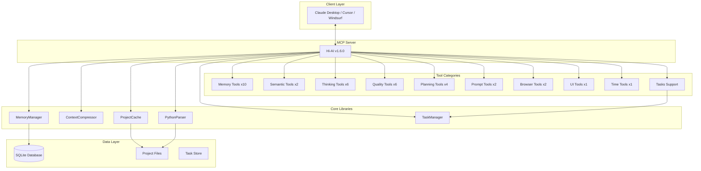

hi-ai\README.ko.md
# Hi-AI

<div align="center">

[](https://smithery.ai/server/@su-record/hi-ai)
[](https://www.npmjs.com/package/@su-record/hi-ai)
[](https://opensource.org/licenses/MIT)
[](https://modelcontextprotocol.io)
[](https://github.com/su-record/hi-ai)
[](https://github.com/su-record/hi-ai)

**Model Context Protocol 기반 AI 개발 어시스턴트**

TypeScript + Python 지원 · 36개 전문 도구 · 지능형 메모리 관리 · 코드 분석 · 추론 프레임워크 · Tasks 지원

<a href="https://glama.ai/mcp/servers/@su-record/hi-ai">
  
</a>

[English](README.md) | [한국어](README.ko.md)

</div>

---

## 목차

- [개요](#개요)
- [주요 기능](#주요-기능)
- [v1.6.0 업데이트](#v160-업데이트)
- [설치](#설치)
- [도구 카탈로그](#도구-카탈로그)
- [아키텍처](#아키텍처)
- [성능](#성능)
- [개발 가이드](#개발-가이드)
- [라이선스](#라이선스)

---

## 개요

Hi-AI는 **Model Context Protocol (MCP)** 표준을 구현한 AI 개발 어시스턴트입니다. 자연어 기반 키워드 인식을 통해 36개의 전문화된 도구를 제공하며, 개발자가 복잡한 작업을 직관적으로 수행할 수 있도록 돕습니다.

### 핵심 가치

- **자연어 기반**: 한국어/영어 키워드로 도구를 자동으로 실행
- **지능형 메모리**: SQLite 기반 컨텍스트 관리 및 압축
- **다중 언어 지원**: TypeScript, JavaScript, Python 코드 분석
- **성능 최적화**: 프로젝트 캐싱 시스템
- **엔터프라이즈 품질**: 100% 테스트 커버리지 및 엄격한 타입 시스템
- **장기 실행 지원**: Tasks를 통한 비동기 작업 관리
- **대규모 데이터**: 커서 기반 페이지네이션

---

## 주요 기능

### 1. 메모리 관리 시스템

세션 전반에 걸쳐 컨텍스트를 유지하고 관리하는 10개의 도구:

- **지능형 저장**: 카테고리별 정보 분류 및 우선순위 관리
- **컨텍스트 압축**: 중요도 기반 컨텍스트 압축 시스템
- **세션 복원**: 이전 작업 상태를 완벽하게 재현
- **SQLite 기반**: 동시성 제어, 인덱싱, 트랜잭션 지원

**주요 도구**:
- `save_memory` - 장기 메모리에 정보 저장
- `recall_memory` - 저장된 정보 검색
- `auto_save_context` - 컨텍스트 자동 저장
- `restore_session_context` - 세션 복원
- `prioritize_memory` - 메모리 우선순위 관리

### 2. 시맨틱 코드 분석

AST 기반 코드 분석 및 탐색 도구:

- **심볼 검색**: 프로젝트 전체에서 함수, 클래스, 변수 위치 파악
- **참조 추적**: 특정 심볼의 모든 사용처 추적
- **다중 언어**: TypeScript, JavaScript, Python 지원
- **프로젝트 캐싱**: LRU 캐시를 통한 성능 최적화

**주요 도구**:
- `find_symbol` - 심볼 정의 검색
- `find_references` - 심볼 참조 찾기

### 3. 코드 품질 분석

포괄적인 코드 메트릭 및 품질 평가:

- **복잡도 분석**: Cyclomatic, Cognitive, Halstead 메트릭
- **결합도/응집도**: 모듈 구조 건전성 평가
- **품질 점수**: A-F 등급 시스템
- **개선 제안**: 실행 가능한 리팩토링 방안

**주요 도구**:
- `analyze_complexity` - 복잡도 메트릭 분석
- `validate_code_quality` - 코드 품질 평가
- `check_coupling_cohesion` - 결합도/응집도 분석
- `suggest_improvements` - 개선 제안
- `apply_quality_rules` - 품질 규칙 적용
- `get_coding_guide` - 코딩 가이드 조회

### 4. 프로젝트 계획 도구

체계적인 요구사항 분석 및 로드맵 생성:

- **PRD 생성**: 제품 요구사항 문서 자동 생성
- **사용자 스토리**: 수용 조건 포함 스토리 작성
- **MoSCoW 분석**: 요구사항 우선순위화
- **로드맵 작성**: 단계별 개발 일정 계획

**주요 도구**:
- `generate_prd` - 제품 요구사항 문서 생성
- `create_user_stories` - 사용자 스토리 작성
- `analyze_requirements` - 요구사항 분석
- `feature_roadmap` - 기능 로드맵 생성

### 5. 순차적 사고 도구

구조화된 문제 해결 및 의사결정 지원:

- **문제 분해**: 복잡한 문제를 단계별로 분해
- **사고 체인**: 순차적 추론 과정 생성
- **다양한 관점**: 분석적/창의적/체계적/비판적 사고
- **실행 계획**: 작업을 실행 가능한 계획으로 변환

**주요 도구**:
- `create_thinking_chain` - 사고 체인 생성
- `analyze_problem` - 문제 분석
- `step_by_step_analysis` - 단계별 분석
- `break_down_problem` - 문제 분해
- `think_aloud_process` - 사고 과정 표현
- `format_as_plan` - 계획 형식화

### 6. 프롬프트 엔지니어링

프롬프트 품질 향상 및 최적화:

- **자동 강화**: 모호한 요청을 구체적으로 변환
- **품질 평가**: 명확성, 구체성, 맥락성 점수화
- **구조화**: 목표, 배경, 요구사항, 품질 기준

**주요 도구**:
- `enhance_prompt` - 프롬프트 강화
- `analyze_prompt` - 프롬프트 품질 분석

### 7. 브라우저 자동화

웹 기반 디버깅 및 테스팅:

- **콘솔 모니터링**: 브라우저 콘솔 로그 캡처
- **네트워크 분석**: HTTP 요청/응답 추적
- **크로스 플랫폼**: Chrome, Edge, Brave 지원

**주요 도구**:
- `monitor_console_logs` - 콘솔 로그 모니터링
- `inspect_network_requests` - 네트워크 요청 분석

### 8. UI 프리뷰

코딩 전 UI 레이아웃 시각화:

- **ASCII 아트**: 6가지 레이아웃 타입 지원
- **반응형 프리뷰**: 데스크탑/모바일 뷰
- **사전 승인**: 구조 확인 후 코딩 시작

**주요 도구**:
- `preview_ui_ascii` - ASCII UI 프리뷰

### 9. 시간 유틸리티

다양한 형식의 시간 조회:

**주요 도구**:
- `get_current_time` - 현재 시간 조회 (ISO, UTC, 타임존 등)

### 10. Tasks 및 Pagination 지원

장기 실행 작업 및 대규모 데이터 처리:

- **Tasks**: MCP 2025-11-25 실험적 기능으로 장기 실행 작업 관리
- **Pagination**: 커서 기반 페이지네이션으로 대규모 목록 처리
- **비동기 작업**: 복잡한 분석 작업을 백그라운드에서 실행
- **상태 추적**: 작업 진행 상황 실시간 모니터링

**Tasks 지원 도구**:
- `find_symbol`, `find_references` (시맨틱 분석)
- `analyze_complexity`, `check_coupling_cohesion`, `validate_code_quality`, `suggest_improvements` (코드 품질)
- `analyze_requirements`, `feature_roadmap`, `generate_prd` (프로젝트 계획)
- `apply_reasoning_framework`, `enhance_prompt_gemini` (추론 및 프롬프트)

---

## v1.6.0 업데이트

### 신규 기능 (2025-01-27)

#### Tasks 지원 (실험적 MCP 기능)

**장기 실행 작업 관리**
- MCP 2025-11-25 Tasks 사양 구현
- 복잡한 분석 작업을 백그라운드에서 실행
- 작업 상태 실시간 추적 및 모니터링
- TTL 기반 자동 정리 (기본 5분, 최대 1시간)

**Tasks API**
- `tasks/get` - 작업 상태 조회
- `tasks/result` - 작업 결과 조회 (완료까지 대기)
- `tasks/list` - 모든 작업 목록 조회 (페이지네이션)
- `tasks/cancel` - 실행 중인 작업 취소
- `notifications/tasks/status` - 상태 변경 알림

**Task 지원 도구 (11개)**
- 시맨틱 분석: `find_symbol`, `find_references`
- 코드 품질: `analyze_complexity`, `check_coupling_cohesion`, `validate_code_quality`, `suggest_improvements`
- 프로젝트 계획: `analyze_requirements`, `feature_roadmap`, `generate_prd`
- 추론/프롬프트: `apply_reasoning_framework`, `enhance_prompt_gemini`

#### Pagination 지원

**커서 기반 페이지네이션**
- MCP 사양 준수 커서 기반 구현
- 대규모 목록 효율적 처리
- 불투명 커서로 보안성 향상

**지원되는 목록 작업**
- `tools/list` - 도구 목록 (기본 20개씩)
- `resources/list` - 리소스 목록
- `prompts/list` - 프롬프트 목록
- `tasks/list` - 작업 목록

#### 통합 효과

- **비동기 작업 지원**: 복잡한 분석을 백그라운드에서 실행
- **대규모 데이터 처리**: 페이지네이션으로 메모리 효율성 향상
- **실시간 모니터링**: 작업 진행 상황 추적
- **향상된 사용자 경험**: 긴 작업 중에도 다른 작업 수행 가능

---

## 설치

### 시스템 요구사항

- Node.js 18.0 이상
- TypeScript 5.0 이상
- MCP 호환 클라이언트 (Claude Desktop, Cursor, Windsurf)
- Python 3.x (Python 코드 분석 시)

### 설치 방법

#### NPM 패키지

```bash
# 글로벌 설치
npm install -g @su-record/hi-ai

# 로컬 설치
npm install @su-record/hi-ai
```

#### Smithery 플랫폼

```bash
# 원클릭 설치
https://smithery.ai/server/@su-record/hi-ai
```

### MCP 클라이언트 설정

Claude Desktop 또는 다른 MCP 클라이언트의 설정 파일에 추가:

```json
{
  "mcpServers": {
    "hi-ai": {
      "command": "hi-ai",
      "args": [],
      "env": {}
    }
  }
}
```

---

## 도구 카탈로그

### 전체 도구 목록 (36개)

| 카테고리 | 도구 수 | 도구 목록 |
|----------|---------|-----------|
| **메모리** | 10 | save_memory, recall_memory, list_memories, search_memories, delete_memory, update_memory, auto_save_context, restore_session_context, prioritize_memory, start_session |
| **시맨틱** | 2 | find_symbol, find_references |
| **사고** | 6 | create_thinking_chain, analyze_problem, step_by_step_analysis, break_down_problem, think_aloud_process, format_as_plan |
| **추론** | 1 | apply_reasoning_framework |
| **코드 품질** | 6 | analyze_complexity, validate_code_quality, check_coupling_cohesion, suggest_improvements, apply_quality_rules, get_coding_guide |
| **계획** | 4 | generate_prd, create_user_stories, analyze_requirements, feature_roadmap |
| **프롬프트** | 2 | enhance_prompt, analyze_prompt |
| **브라우저** | 2 | monitor_console_logs, inspect_network_requests |
| **UI** | 1 | preview_ui_ascii |
| **시간** | 1 | get_current_time |

### Tasks 지원 도구 (11개)

다음 도구들은 장기 실행 작업으로 Tasks를 지원합니다:

- **시맨틱 분석**: `find_symbol`, `find_references`
- **코드 품질**: `analyze_complexity`, `check_coupling_cohesion`, `validate_code_quality`, `suggest_improvements`
- **프로젝트 계획**: `analyze_requirements`, `feature_roadmap`, `generate_prd`
- **추론/프롬프트**: `apply_reasoning_framework`, `enhance_prompt_gemini`

### 키워드 매핑 예시

#### 메모리 도구

| 도구 | 한국어 | 영어 |
|------|--------|------|
| save_memory | 기억해, 저장해 | remember, save this |
| recall_memory | 떠올려, 기억나 | recall, remind me |
| auto_save_context | 커밋, 저장 | commit, checkpoint |

#### 코드 분석 도구

| 도구 | 한국어 | 영어 |
|------|--------|------|
| find_symbol | 함수 찾아, 클래스 어디 | find function, where is |
| analyze_complexity | 복잡도, 복잡한지 | complexity, how complex |
| validate_code_quality | 품질, 리뷰 | quality, review |

#### Tasks 도구

| 도구 | 한국어 | 영어 |
|------|--------|------|
| tasks/get | 작업 상태, 진행 상황 | task status, progress |
| tasks/result | 결과 가져와, 완료될 때까지 | get result, wait for completion |
| tasks/cancel | 작업 취소, 중지해 | cancel task, stop |

---

## 아키텍처

### 시스템 구조



### 핵심 컴포넌트

#### TaskManager
- **역할**: 장기 실행 작업의 생명주기 관리
- **기능**: 작업 생성, 상태 추적, 결과 저장, TTL 관리
- **상태**: working, input_required, completed, failed, cancelled
- **알림**: 실시간 상태 변경 알림

#### Pagination System
- **역할**: 대규모 목록 데이터의 효율적 처리
- **방식**: 커서 기반 페이지네이션
- **보안**: 불투명 커서로 데이터 노출 방지

### 데이터 플로우

```
사용자 입력 (자연어)
    ↓
키워드 매칭 (도구 선택)
    ↓
Tasks 지원 확인
    ↓
일반 실행 또는 Task 생성
    ↓
비동기 실행 (Tasks)
    ↓
상태 폴링 또는 실시간 알림
    ↓
결과 반환
```

---

## 성능

### 주요 최적화

#### 프로젝트 캐싱
- LRU 캐시를 통한 반복 분석 성능 향상
- 5분 TTL로 최신 상태 유지
- 메모리 제한을 통한 리소스 관리

#### 메모리 작업
- SQLite 트랜잭션으로 배치 작업 최적화
- 시간 복잡도 개선: O(n²) → O(n)
- 인덱싱을 통한 빠른 조회

#### Tasks 최적화
- 백그라운드 실행으로 UI 응답성 향상
- TTL 기반 자동 정리로 메모리 누수 방지
- 상태 기반 폴링으로 효율적 모니터링

#### 응답 형식
- 간결한 응답 포맷으로 전환
- 핵심 정보 중심의 출력

**v1.5.0 응답 예시**:
```json
{
  "action": "save_memory",
  "key": "test-key",
  "value": "test-value",
  "category": "general",
  "timestamp": "2025-01-16T12:34:56.789Z",
  "status": "success",
  "metadata": { ... }
}
```

**v1.6.0 응답 예시**:
```
✓ Saved: test-key
Category: general
```

---

## 개발 가이드

### 환경 설정

```bash
# 리포지토리 클론
git clone https://github.com/su-record/hi-ai.git
cd hi-ai

# 의존성 설치
npm install

# 빌드
npm run build

# 개발 모드
npm run dev
```

### 테스트

```bash
# 전체 테스트 실행
npm test

# Watch 모드
npm run test:watch

# UI 모드
npm run test:ui

# 커버리지 리포트
npm run test:coverage
```

### 코드 스타일

- **TypeScript**: strict 모드
- **타입**: `src/types/tool.ts` 사용
- **테스트**: 100% 커버리지 유지
- **커밋**: Conventional Commits 형식

### 새 도구 추가

1. `src/tools/category/` 디렉토리에 파일 생성
2. `ToolDefinition` 인터페이스 구현
3. `src/index.ts`에 도구 등록
4. `tests/unit/` 디렉토리에 테스트 작성
5. README 업데이트

### Pull Request

1. 기능 브랜치 생성: `feature/tool-name`
2. 테스트 작성 및 통과 확인
3. 빌드 성공 확인
4. PR 생성 및 리뷰 요청

---

## 기여자

<a href="https://github.com/su-record/hi-ai/graphs/contributors">
  
</a>

### 특별 감사

- **[Smithery](https://smithery.ai)** - MCP 서버 배포 및 원클릭 설치 플랫폼 제공

---

## 라이선스

MIT License - 자유롭게 사용, 수정, 배포 가능

---

## 인용

이 프로젝트를 연구나 상업적 용도로 사용하실 경우:

```bibtex
@software{hi-ai2024,
  author = {Su},
  title = {Hi-AI: Natural Language MCP Server for AI-Assisted Development},
  year = {2024},
  version = {1.6.0},
  url = {https://github.com/su-record/hi-ai}
}
```

---

<div align="center">

## Star History

[](https://star-history.com/#su-record/hi-ai&Date)

<br>

**Hi-AI v1.6.0**

Tasks 지원 · 커서 기반 페이지네이션 · 36개 전문 도구 · 122개 테스트 · 100% 커버리지

Made with ❤️ by [Su](https://github.com/su-record)

<br>

[🏠 Homepage](https://github.com/su-record/hi-ai) ·
[📚 Documentation](https://github.com/su-record/hi-ai#readme) ·
[🐛 Issues](https://github.com/su-record/hi-ai/issues) ·
[💬 Discussions](https://github.com/su-record/hi-ai/discussions)

</div>