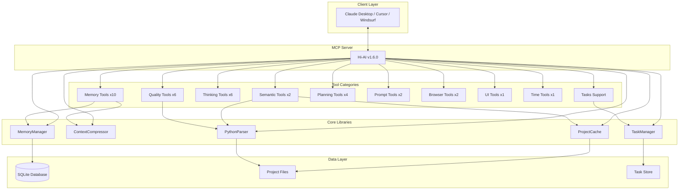

# SSD-AI

<div align="center">

[](https://smithery.ai/server/ssdeanx/ssd-ai)
[](https://www.npmjs.com/package/@su-record/hi-ai)
[](https://opensource.org/licenses/MIT)
[](https://modelcontextprotocol.io)
[](https://github.com/ssdeanx/ssd-ai)
[](https://github.com/ssdeanx/ssd-ai)

**AI Development Assistant based on Model Context Protocol**

TypeScript + Python Support · 36 Specialized Tools · Intelligent Memory Management · Code Analysis · Reasoning Framework · Tasks Support

<a href="https://glama.ai/mcp/servers/@su-record/hi-ai">
  
</a>

[English](README.md) | [한국어](README.ko.md)

</div>

---

## Table of Contents

- [Overview](#overview)
- [Key Features](#key-features)
- [v1.6.0 Update](#v160-update)
- [Installation](#installation)
- [Tool Catalog](#tool-catalog)
- [Architecture](#architecture)
- [Performance](#performance)
- [Development Guide](#development-guide)
- [License](#license)

---

## Overview

Hi-AI is an AI development assistant that implements the **Model Context Protocol (MCP)** standard. It provides 36 specialized tools through natural language keyword recognition, helping developers perform complex tasks intuitively.

### Core Values

- **Natural Language**: Execute tools automatically through Korean/English keywords
- **Intelligent Memory**: Context management and compression using SQLite
- **Multi-Language Support**: TypeScript, JavaScript, Python code analysis
- **Performance Optimization**: Project caching system
- **Enterprise Quality**: 100% test coverage and strict type system
- **Long-Running Support**: Task management for asynchronous operations
- **Large-Scale Data**: Cursor-based pagination

---

## Key Features

### 1. Memory Management System

10 tools for maintaining context across sessions:

- **Intelligent Storage**: Information classification and priority management by category
- **Context Compression**: Priority-based context compression system
- **Session Restoration**: Perfect recreation of previous work states
- **SQLite-Based**: Concurrent control, indexing, transaction support

**Key Tools**:

- `save_memory` - Store information in long-term memory
- `recall_memory` - Search stored information
- `auto_save_context` - Automatic context saving
- `restore_session_context` - Session restoration
- `prioritize_memory` - Memory priority management

### 2. Semantic Code Analysis

AST-based code analysis and navigation tools:

- **Symbol Search**: Locate function, class, variable positions across projects
- **Reference Tracking**: Track all usages of specific symbols
- **Multi-Language**: TypeScript, JavaScript, Python support
- **Project Caching**: Performance optimization through LRU cache

**Key Tools**:

- `find_symbol` - Search for symbol definitions
- `find_references` - Find symbol references

### 3. Code Quality Analysis

Comprehensive code metrics and quality evaluation:

- **Complexity Analysis**: Cyclomatic, Cognitive, Halstead metrics
- **Coupling/Cohesion**: Structural soundness evaluation
- **Quality Scores**: A-F grade system
- **Improvement Suggestions**: Actionable refactoring recommendations

**Key Tools**:

- `analyze_complexity` - Complexity metric analysis
- `validate_code_quality` - Code quality evaluation
- `check_coupling_cohesion` - Coupling/cohesion analysis
- `suggest_improvements` - Improvement suggestions
- `apply_quality_rules` - Quality rule application
- `get_coding_guide` - Coding guide lookup

### 4. Project Planning Tools

Systematic requirements analysis and roadmap generation:

- **PRD Generation**: Automatic product requirements document creation
- **User Stories**: Story writing including acceptance criteria
- **MoSCoW Analysis**: Requirements prioritization
- **Roadmap Creation**: Step-by-step development schedule planning

**Key Tools**:
- `generate_prd` - Product requirements document generation
- `create_user_stories` - User story creation
- `analyze_requirements` - Requirements analysis
- `feature_roadmap` - Feature roadmap creation

### 5. Sequential Thinking Tools

Structured problem solving and decision making support:

- **Problem Decomposition**: Break down complex problems step by step
- **Thinking Chains**: Sequential reasoning process generation
- **Multiple Perspectives**: Analytical/Creative/Systematic/Critical thinking
- **Execution Plans**: Convert tasks into executable plans

**Key Tools**:

- `create_thinking_chain` - Thinking chain creation
- `analyze_problem` - Problem analysis
- `step_by_step_analysis` - Step-by-step analysis
- `break_down_problem` - Problem decomposition
- `think_aloud_process` - Thinking process expression
- `format_as_plan` - Plan formatting

### 6. Prompt Engineering

Prompt quality improvement and optimization:

- **Automatic Enhancement**: Convert vague requests to specific ones
- **Quality Evaluation**: Score clarity, specificity, contextuality
- **Structuring**: Goal, background, requirements, quality criteria

**Key Tools**:

- `enhance_prompt` - Prompt enhancement
- `analyze_prompt` - Prompt quality analysis

### 7. Browser Automation

Web-based debugging and testing:

- **Console Monitoring**: Browser console log capture
- **Network Analysis**: HTTP request/response tracking
- **Cross-Platform**: Chrome, Edge, Brave support

**Key Tools**:

- `monitor_console_logs` - Console log monitoring
- `inspect_network_requests` - Network request analysis

### 8. UI Preview

Pre-coding UI layout visualization:

- **ASCII Art**: Support for 6 layout types
- **Responsive Preview**: Desktop/mobile views
- **Pre-Approval**: Confirm structure before coding

**Key Tools**:

- `preview_ui_ascii` - ASCII UI preview

### 9. Time Utilities

Various format time queries:

**Key Tools**:

- `get_current_time` - Current time query (ISO, UTC, timezones, etc.)

### 10. Tasks and Pagination Support

Long-running operations and large-scale data processing:

- **Tasks**: MCP 2025-11-25 experimental feature for long-running task management
- **Pagination**: Cursor-based pagination for large dataset processing
- **Asynchronous Operations**: Execute complex analysis tasks in background
- **Status Tracking**: Real-time task progress monitoring

**Tasks-Enabled Tools**:

- `find_symbol`, `find_references` (semantic analysis)
- `analyze_complexity`, `check_coupling_cohesion`, `validate_code_quality`, `suggest_improvements` (code quality)
- `analyze_requirements`, `feature_roadmap`, `generate_prd` (project planning)
- `apply_reasoning_framework`, `enhance_prompt_gemini` (reasoning and prompts)

---

## v1.6.0 Update

### New Features (2025-01-27)

#### Tasks Support (Experimental MCP Feature)

**Long-Running Task Management**

- Implementation of MCP 2025-11-25 Tasks specification
- Execute complex analysis tasks in background
- Real-time task status tracking and monitoring
- TTL-based automatic cleanup (default 5 minutes, max 1 hour)

**Tasks API**

- `tasks/get` - Query task status
- `tasks/result` - Query task result (wait until completion)
- `tasks/list` - List all tasks (with pagination)
- `tasks/cancel` - Cancel running task
- `notifications/tasks/status` - Status change notifications

**Task-Enabled Tools (11 tools)**

- Semantic Analysis: `find_symbol`, `find_references`
- Code Quality: `analyze_complexity`, `check_coupling_cohesion`, `validate_code_quality`, `suggest_improvements`
- Project Planning: `analyze_requirements`, `feature_roadmap`, `generate_prd`
- Reasoning/Prompts: `apply_reasoning_framework`, `enhance_prompt_gemini`

#### Pagination Support

**Cursor-Based Pagination**

- MCP specification compliant cursor-based implementation
- Efficient processing of large lists
- Enhanced security through opaque cursors

**Supported List Operations**

- `tools/list` - Tool list (20 items by default)
- `resources/list` - Resource list
- `prompts/list` - Prompt list
- `tasks/list` - Task list

#### Integration Effects

- **Asynchronous Operation Support**: Execute complex analysis in background
- **Large-Scale Data Processing**: Improved memory efficiency through pagination
- **Real-Time Monitoring**: Task progress tracking
- **Enhanced User Experience**: Perform other tasks during long operations

---

## Installation

### System Requirements

- Node.js 18.0 or higher
- TypeScript 5.0 or higher
- MCP-compatible client (Claude Desktop, Cursor, Windsurf)
- Python 3.x (for Python code analysis)

### Installation Methods

#### NPM Package

```bash
# Global installation
npm install -g @ssdeanx/ssd-ai

# Local installation
npm install @ssdeanx/ssd-ai
```

#### Smithery Platform

```bash
# One-click installation
https://smithery.ai/server/@su-record/hi-ai
```

### MCP Client Configuration

Add to your Claude Desktop or other MCP client's configuration file:

```json
{
  "mcpServers": {
    "hi-ai": {
      "command": "hi-ai",
      "args": [],
      "env": {}
    }
  }
}
```

---

## Tool Catalog

### Complete Tool List (36 tools)

| Category | Count | Tool List |
|----------|-------|-----------|
| **Memory** | 10 | save_memory, recall_memory, list_memories, search_memories, delete_memory, update_memory, auto_save_context, restore_session_context, prioritize_memory, start_session |
| **Semantic** | 2 | find_symbol, find_references |
| **Thinking** | 6 | create_thinking_chain, analyze_problem, step_by_step_analysis, break_down_problem, think_aloud_process, format_as_plan |
| **Reasoning** | 1 | apply_reasoning_framework |
| **Code Quality** | 6 | analyze_complexity, validate_code_quality, check_coupling_cohesion, suggest_improvements, apply_quality_rules, get_coding_guide |
| **Planning** | 4 | generate_prd, create_user_stories, analyze_requirements, feature_roadmap |
| **Prompt** | 2 | enhance_prompt, analyze_prompt |
| **Browser** | 2 | monitor_console_logs, inspect_network_requests |
| **UI** | 1 | preview_ui_ascii |
| **Time** | 1 | get_current_time |

### Tasks-Enabled Tools (11 tools)

The following tools support long-running operations through Tasks:

- **Semantic Analysis**: `find_symbol`, `find_references`
- **Code Quality**: `analyze_complexity`, `check_coupling_cohesion`, `validate_code_quality`, `suggest_improvements`
- **Project Planning**: `analyze_requirements`, `feature_roadmap`, `generate_prd`
- **Reasoning/Prompts**: `apply_reasoning_framework`, `enhance_prompt_gemini`

### Keyword Mapping Examples

#### Memory Tools

| Tool | English | Korean |
|------|---------|--------|
| save_memory | remember, save this | 기억해, 저장해 |
| recall_memory | recall, remind me | 떠올려, 기억나 |
| auto_save_context | commit, checkpoint | 커밋, 저장 |

#### Code Analysis Tools

| Tool | English | Korean |
|------|---------|--------|
| find_symbol | find function, where is | 함수 찾아, 클래스 어디 |
| analyze_complexity | complexity, how complex | 복잡도, 복잡한지 |
| validate_code_quality | quality, review | 품질, 리뷰 |

#### Tasks Tools

| Tool | English | Korean |
|------|---------|--------|
| tasks/get | task status, progress | 작업 상태, 진행 상황 |
| tasks/result | get result, wait for completion | 결과 가져와, 완료될 때까지 |
| tasks/cancel | cancel task, stop | 작업 취소, 중지해 |

---

## Architecture

### System Structure



### Core Components

#### TaskManager
- **Role**: Lifecycle management of long-running tasks
- **Features**: Task creation, status tracking, result storage, TTL management
- **States**: working, input_required, completed, failed, cancelled
- **Notifications**: Real-time status change notifications

#### Pagination System
- **Role**: Efficient processing of large list data
- **Method**: Cursor-based pagination
- **Security**: Prevent data exposure through opaque cursors

### Data Flow

```bash
User Input (Natural Language)
    ↓
Keyword Matching (Tool Selection)
    ↓
Tasks Support Check
    ↓
Normal Execution or Task Creation
    ↓
Asynchronous Execution (Tasks)
    ↓
Status Polling or Real-time Notifications
    ↓
Result Return
```

---

## Performance

### Major Optimizations

#### Project Caching

- Performance improvement for repeated analysis through LRU cache
- Maintain latest state with 5-minute TTL
- Resource management through memory limits

#### Memory Operations

- Batch operation optimization through SQLite transactions
- Time complexity improvement: O(n²) → O(n)
- Fast lookup through indexing

#### Tasks Optimization

- Improved UI responsiveness through background execution
- Prevent memory leaks through TTL-based automatic cleanup
- Efficient monitoring through status-based polling

#### Response Format

- Switch to concise response format
- Output focused on core information

**v1.5.0 Response Example**:

```json
{
  "action": "save_memory",
  "key": "test-key",
  "value": "test-value",
  "category": "general",
  "timestamp": "2025-01-16T12:34:56.789Z",
  "status": "success",
  "metadata": { ... }
}
```

**v1.6.0 Response Example**:

```bash
✓ Saved: test-key
Category: general
```

---

## Development Guide

### Environment Setup

```bash
# Clone repository
git clone https://github.com/ssdeanx/ssd-ai.git
cd ssd-ai

# Install dependencies
npm install

# Build
npm run build

# Development mode
npm run dev
```

### Testing

```bash
# Run all tests
npm test

# Watch mode
npm run test:watch

# UI mode
npm run test:ui

# Coverage report
npm run test:coverage
```

### Code Style

- **TypeScript**: strict mode
- **Types**: Use `src/types/tool.ts`
- **Tests**: Maintain 100% coverage
- **Commits**: Conventional Commits format

### Adding New Tools

1. Create file in `src/tools/category/` directory
2. Implement `ToolDefinition` interface
3. Register tool in `src/index.ts`
4. Write tests in `tests/unit/` directory
5. Update README

### Pull Request

1. Create feature branch: `feature/tool-name`
2. Write and pass tests
3. Confirm successful build
4. Create PR and request review

---

## Contributors

<a href="https://github.com/ssdeanx/ssd-ai/graphs/contributors">
  
</a>

### Special Thanks

- **[Smithery](https://smithery.ai)** - MCP server deployment and one-click installation platform

---

## License

MIT License - Free to use, modify, and distribute

---

## Citation

If you use this project for research or commercial purposes:

```bibtex
@software{hi-ai2024,
  author = {ssdeanx},
  title = {Hi-AI: Natural Language MCP Server for AI-Assisted Development},
  year = {2024},
  version = {1.6.0},
  url = {https://github.com/su-record/hi-ai}
}
```

---

<div align="center">

## Star History

[](https://star-history.com/#su-record/hi-ai&Date)

<br>

**Hi-AI v1.6.0**

Tasks Support · Cursor-Based Pagination · 36 Specialized Tools · 122 Tests · 100% Coverage

Made with ❤️ by [Su](https://github.com/su-record)

<br>

[🏠 Homepage](https://github.com/su-record/hi-ai) ·
[📚 Documentation](https://github.com/su-record/hi-ai#readme) ·
[🐛 Issues](https://github.com/su-record/hi-ai/issues) ·
[💬 Discussions](https://github.com/su-record/hi-ai/discussions)

</div>
